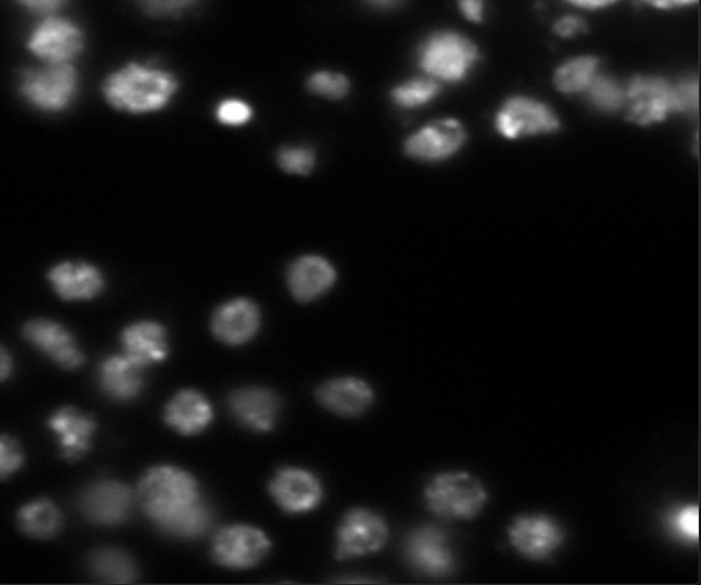
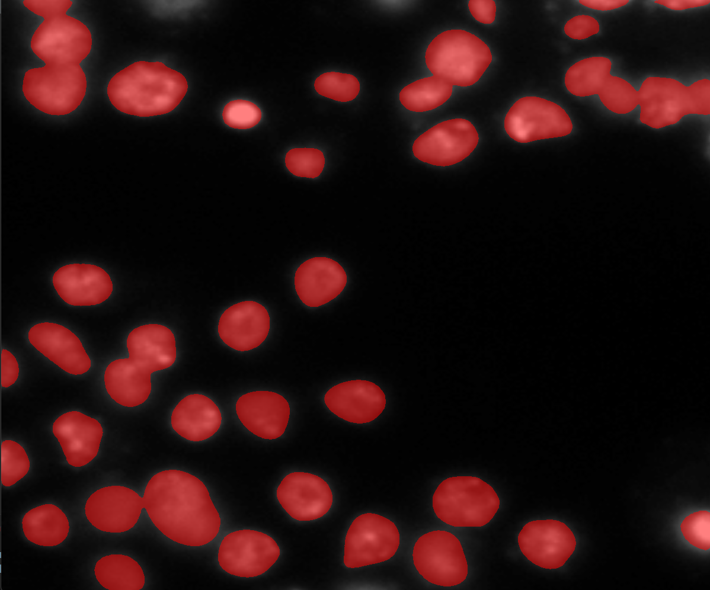

# Interactive Cell Segmentation Software
Fully voice-controlled software which enables you to zoom in, zoom out, color cells using Cellpose and analize an image!
Available commands:
- zoom_in: Zooms in the current view.
- zoom_out: Zooms out the current view.
- cell_segmentation: Colors every cell.
- quit: Closes everything.
- change_image: Changes image to a different one.
- lighting_modification: Modifies the brightness.
- undo_all: Everything goes back to original
- none: Does nothing. 
Example: 
"Please color every cell in red" 
# Before:

# After:
